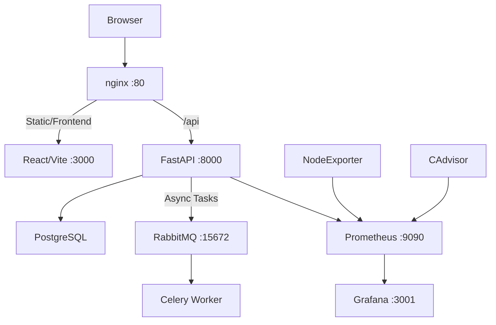

# Devops Fullstack Platform [](https://github.com/user/repo/actions) [](https://codecov.io/gh/user/repo) [](https://hub.docker.com)

A Dockerized full-stack **production-grade e-commerce platform** built with **React 18**, **FastAPI**, **PostgreSQL**, **Celery**, **nginx**, **RabbitMQ**, **Prometheus**, and **Grafana**. Features customer storefront (products/cart/auth), admin dashboard, full monitoring – perfect for DevOps/Fullstack resumes.

## 🚀 Quick Demo
| Home/Shop | Cart/Auth | Admin Dashboard | Grafana |
|-----------|-----------|-----------------|---------|
|  |  |  |  |

*(Add actual screenshots in /screenshots/ folder for GH README render)*

## ✨ Current Capabilities
- Storefront: Product browsing, localStorage cart, auth flows.
- Admin: CRUD products, feedback review.
- Background: Celery jobs (RabbitMQ).
- Monitoring: Prometheus metrics + Grafana dashboards.

## 🏗️ Architecture


## Services (docker-compose.yml)
| Service | Purpose | Port |
|---------|---------|------|
| frontend | React app | 3000 |
| backend | FastAPI API | 8000 |
| db | Postgres | internal |
| rabbitmq | Broker | 15672 |
| worker | Celery | internal |
| nginx | Proxy | 80 |
| prometheus/grafana | Monitoring | 9090/3001 |

## 🚀 Local Development (5s Setup)
```bash
cp .env.example .env
docker compose up -d --build
```
- `localhost` – Full app
- `localhost:8000/docs` – Swagger API
- `localhost:3001` – Grafana

Verify: `./scripts/smoke-phase1.sh`

## Backend Modules
- **FastAPI** routes/services/schemas (modular CRUD/auth/JWT)
- **SQLAlchemy** models + Alembic migrations

## Frontend Pages
- Home, Shop (products+cart), Cart, Account (auth), Admin (protected)

## Quality & CI
- Tests: pytest/Vitest, smoke scripts
- Linting: Ruff
- CI: GitHub Actions + SonarQube ready
- Coverage: Planned >85%

## Key Learnings (Resume Highlights)
- **DevOps**: Multi-service Docker orchestration, monitoring stack, env-driven deploys.
- **Fullstack**: React Router/state, FastAPI/Pydantic/SQLAlchemy, JWT/Celery async.
- **Best Practices**: Tests/CI, modular code, security (bcrypt/JWT), prod monitoring.


## License
MIT
